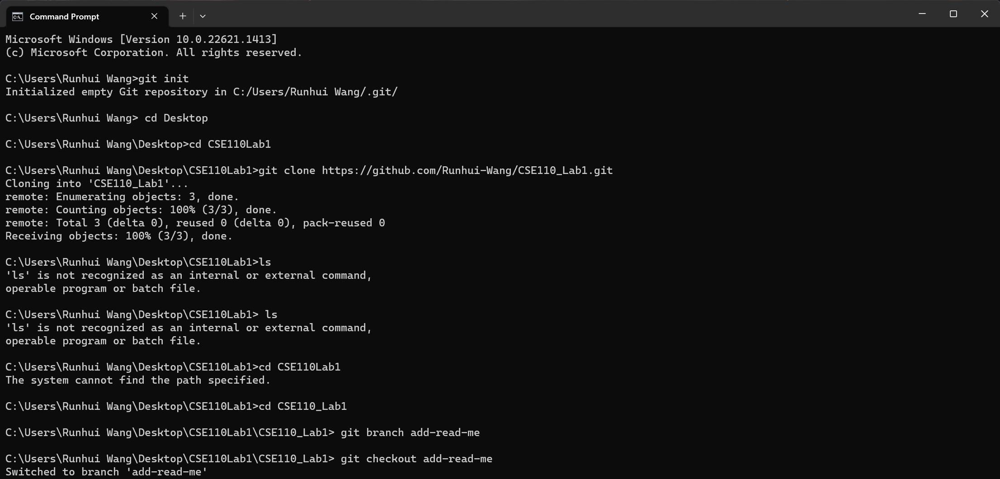
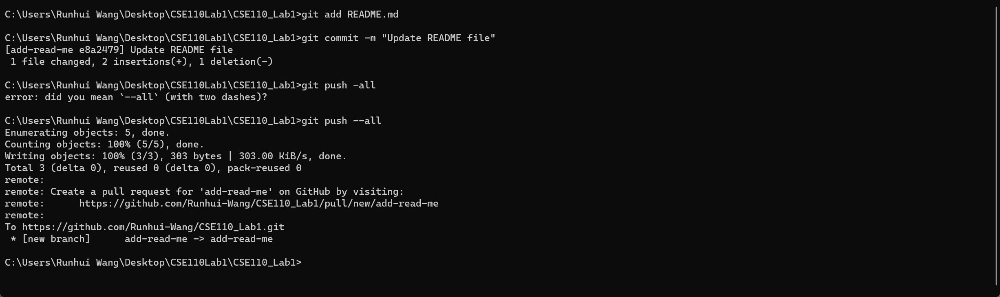
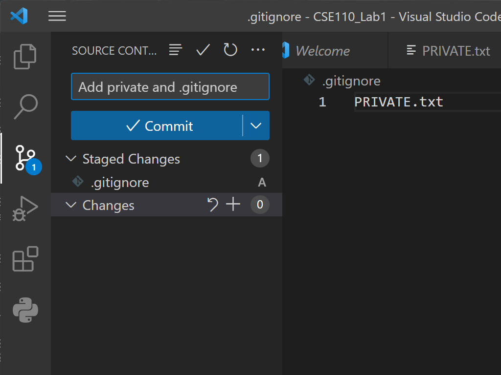

# Heading 1
## Heading 2
### Heading 3
#### Heading 4
##### Heading 5
###### Heading 6

**Bold text** or __Bold text__
*Italic text* or _Italic text_
~~Strikethrough text~~

> This is a blockquote.


`Inline code`

\```
Code block
\```

[google link](https://google.com)

[Section ](#Heading 1)

[Link to another file](README.md)


- Unordered list item
- duh
1. Ordered list item
2. duh


- [x] Completed task
- [ ] Incomplete task